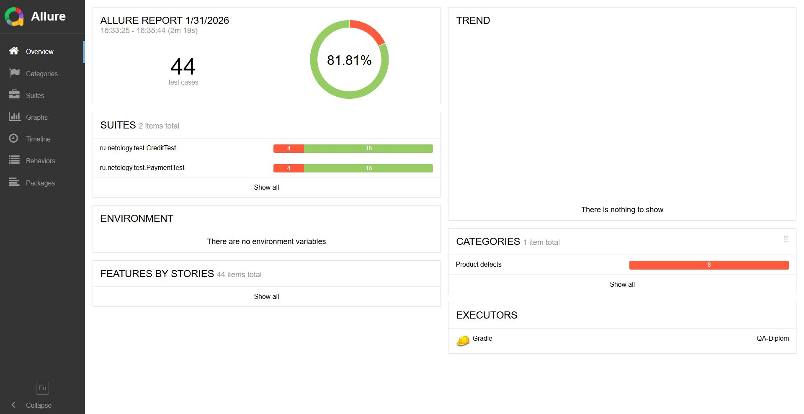
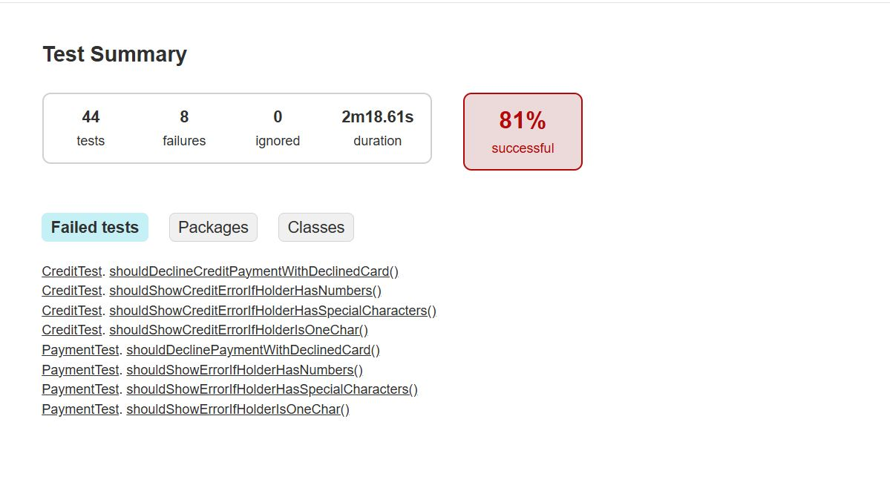

# Краткое описание проведённого тестирования

В рамках дипломного проекта было проведено автоматизированное тестирование веб-приложения покупки тура с использованием UI-тестов и интеграционных проверок с базой данных.

Тестирование охватывает следующие функциональные области:

* оплата тура банковской картой;
* покупка тура в кредит;
* валидация полей платёжной формы;
* корректность сохранения данных в базе данных.

# Количество тест-кейсов и результаты прогона

В рамках проекта реализовано:

**Всего автотестов:** 44

**Позитивных тестов:** 36

**Негативных тестов:** 8

# Результаты последнего прогона автотестов:

**Успешно выполнено:** 36 теста (81,81%)

**Завершились с ошибкой:** 8 тестов (18,18%)

# Общие рекомендации
* Исправить баги, описанные в [issues](https://github.com/Katy919/QA-Diplom/issues)

* В поле `Владелец` внести изменения и оставить только латиницу
* Реализовать явное переключение между `Купить` и `Купить в кредит`
* Добавить ограничение по количеству символов в поле `Владелец`

